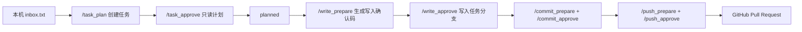

# hermes-codex-bridge

用 Telegram 安全审批 Codex CLI 任务：先只读计划，再显式确认写文件、commit 和 push；普通聊天永远不进入 Codex 队列。

`hermes-codex-bridge` 是一个 Hermes + Codex CLI 桥接工具包，用于把本地 Codex CLI、Telegram 移动审核、任务审批队列和可选的飞书/OpenClaw 协作流程串成一套可复用系统。

它适合这些场景：

- 在手机上查看 Codex CLI 任务状态。
- 远程审批只读计划，避免 agent 直接改文件。
- 对写文件、commit、push 做分阶段显式确认。
- 把 AI agent 的远程办公入口做成固定命令，而不是远程 shell。
- 在团队中演示“安全门槛优先”的 agent 审批模式。

## 核心特性

- Telegram quick commands：`/task_plan`、`/task_approve`、`/write_prepare`、`/commit_prepare`、`/push_prepare`
- 只读计划模式：Codex CLI 使用 `--sandbox read-only`
- 显式写入模式：写文件必须先有 `planned` 任务和一次性确认码
- 任务分支隔离：写文件只发生在 `codex/<task_id>` 分支
- 分阶段审批：write、commit、push 不共用确认码
- 禁用 deploy：当前版本只返回禁用说明，不执行部署
- 普通聊天不入队：Telegram 普通消息永远不会进入 Codex 任务队列
- 本机状态隔离：token、profile state、日志、PID 和任务队列不进入 git
- 开机可用：Hermes gateway 通过 macOS launchd 自启动，bridge 随 quick command 调用工作

## 工作流



## 快速体验

安装并验证 Codex CLI：

```bash
npm install -g @openai/codex
codex login
codex --version
```

克隆项目并检查脚本：

```bash
git clone https://github.com/38209930/hermes-codex-bridge.git
cd hermes-codex-bridge
bash -n scripts/*.sh
```

配置 Hermes Telegram profile 后，常用命令是：

```text
/codex_status
/task_new
/task_plan
/task_approve
/task_show
/write_prepare <task_id>
/write_approve <task_id> <code>
/commit_prepare <task_id>
/commit_approve <task_id> <code>
/push_prepare <task_id>
/push_approve <task_id> <code>
```

完整步骤见 [部署说明](docs/deployment.md) 和 [V3 显式审批写操作](docs/v3-explicit-approval.md)。

## 自启动要求

Telegram 审批链路依赖 Hermes gateway 常驻。Mac 侧应确保 `telegram-codex` profile 已安装为 launchd LaunchAgent，并满足：

- `RunAtLoad=true`
- service 已 loaded
- service 正在 running

检查：

```bash
hermes --profile telegram-codex gateway status
launchctl print gui/$(id -u)/ai.hermes.gateway-telegram-codex
```

bridge 不需要单独常驻服务；它由 Hermes quick commands 按需调用。任务 runner 会在审批后临时由 launchd 启动。

## 安全模型

本项目的第一原则是：远程入口必须可审计、可拒绝、可回滚。

Telegram/Codex 桥接不会把 Telegram 任意文本当作 shell 命令执行。任务内容先进入本地 inbox 文件，再通过固定 Hermes quick commands 审批。只读审批后的任务使用 `--sandbox read-only` 运行 Codex CLI，并要求只输出计划、风险、验收标准和建议命令。

V3 写操作必须先有只读计划，再通过 `/write_prepare <task_id>` 生成一次性确认码。写文件只在 `codex/<task_id>` 分支执行；commit 和 push 需要单独的确认码。deploy 当前版本禁用。

## 适合谁使用

- 经常用 Codex CLI、希望手机上验收任务的开发者。
- 想把 AI agent 接入 Telegram，但不想把 bot 变成远程 shell 的团队。
- 需要演示 agent 安全审批、任务分支、主干保护和审计日志的工程团队。
- 正在搭建 Hermes、飞书、Telegram 或 OpenClaw 协作入口的用户。

## 不适合什么

- 不适合直接控制 Codex App 当前窗口。
- 不适合无审批地执行任意 Telegram 文本。
- 不适合在生产环境直接开放 deploy。
- 不适合绕过 GitHub PR 和主干保护。

## 文档

- [使用说明](docs/usage.md)
- [开发说明](docs/development.md)
- [部署说明](docs/deployment.md)
- [运行维护原则](docs/operations-principles.md)
- [分支与主干保护](docs/branch-policy.md)
- [V3 显式审批写操作](docs/v3-explicit-approval.md)
- [未来写操作能力设计原则](docs/future-write-capabilities.md)
- [Telegram + Codex 桥接](docs/telegram-codex.md)
- [飞书/Lark + OpenClaw](docs/feishu-openclaw.md)
- [安全说明](docs/security.md)
- [Codex Plugin 分发说明](docs/codex-plugin.md)
- [项目传播计划](docs/marketing.md)

## 包含内容

- `scripts/mac-codex-bridge.sh`：Mac Hermes + Codex CLI 的 Telegram 桥接脚本
- `scripts/hermes-enable-quick-command-args.sh`：Hermes quick command 参数补丁
- `plugins/hermes-codex-bridge/`：Codex Plugin 分发包
- `.agents/plugins/marketplace.json`：Codex Plugin marketplace 入口
- `docs/usage.md`：系统使用说明
- `docs/deployment.md`：部署与本地配置说明
- `docs/development.md`：继续开发说明
- `docs/branch-policy.md`：分支开发与主干保护规则
- `playbooks/`：角色、协作、Codex、Hermes、飞书和 API 改造手册
- `projects/`：可选 OpenClaw 多项目工作区模板
- 飞书/OpenClaw 配置模板
- 通用 API 框架加固与改造手册

## 目录结构

```text
scripts/        Mac Hermes、Codex CLI 和 Telegram 本地辅助脚本
docs/           安装、部署、使用和安全文档
playbooks/      协作、角色、飞书、Codex、Hermes 和 API 手册
projects/       可选项目模板与项目记忆结构
```

## 飞书/Lark

飞书接入按 OpenClaw 协作通道记录。真实 `App ID`、`App Secret`、群 ID 和租户信息必须保留在 git 之外。

详见 [飞书/Lark + OpenClaw](docs/feishu-openclaw.md)。

## 开发协作

所有贡献都应从功能分支提交，通过 Pull Request 合并。`master` 是受保护主干，不允许日常开发直接 push。

详见 [分支与主干保护](docs/branch-policy.md)。

## 语言约定

- 默认使用中文编写对话、计划、执行说明、验收说明、README、使用文档、部署文档和项目管理文档。
- 面向开源、外部协作或国际读者的文档可以提供中英文两个版本；中文为主版本，英文版可放在同文件的英文摘要区，或按 `docs/en/` 目录维护。
- 代码保留字、包名、命令、API 字段、协议字段、错误原文保持原语言，避免破坏工程语义。
- 变量名、函数名、类名、文件名沿用项目既有风格，不强行中文化。
- 注释默认中文，但只在确实有助于理解时添加。

## 开源卫生

不要提交：

- `migration/`
- `node_modules/`
- `.env` or profile `.env` files
- Telegram bot token
- 飞书/Lark app secret
- Hermes state databases
- 任务队列状态、日志、PID 文件或 lock 文件

发布前请运行 [安全说明](docs/security.md) 中的敏感信息扫描。
